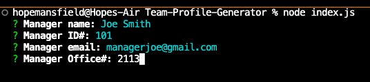
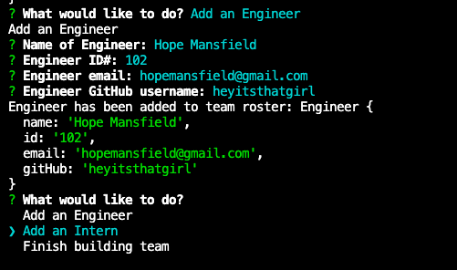
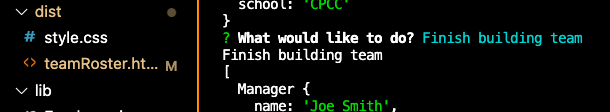
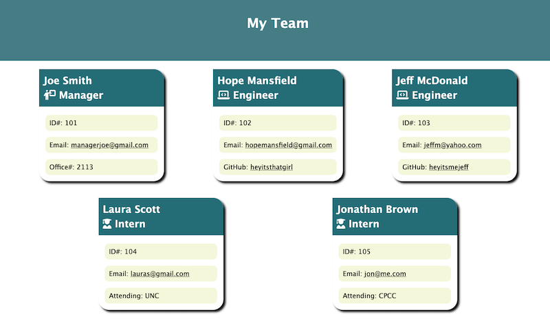
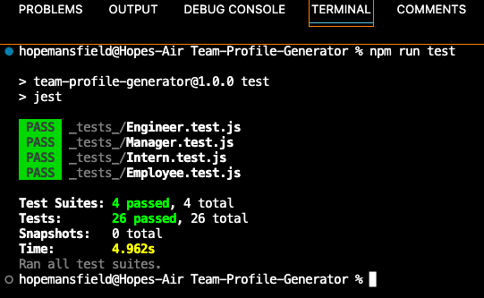

# Team Profile Generator

## Description

The Team Profile Generator is a command-line application that takes in information about employees on a software engineering team, then generates an HTML webpage that displays a summary of each employee's information.

## Table of Contents

[Installation](#installation)

[Usage](#usage)

[Testing](#testing)

[Contributing](#contributing)

[Questions](#questions)

## Installation

Team Profile Generator requires Node.js and Node Package Manager (npm).

From the command line, navigate to the directory where you would like to keep the app and run the following code:

```md
git clone https://github.com/heyitsthatgirl/Team-Profile-Generator.git
```

Navigate into Team Profile Generator and run:

```md
npm install
```

to install the packages necessary to use the app. This includes the `jest` and `inquirer` packages.

## Usage

To initiate the app, navigate to the root directory from the command line and run:

```md
node index.js
```

Follow the prompts from inquirer, adding as many employees to your roster as you like.

When you are ready to finish building your team roster, select 'Finish building team' from the main menu. At this time, a `teamRoster.html` file will be created in your `dist` folder.

Open the file in your browser to see your roster.

> A video showing a full walk-through of this app's functionality can be viewed [here](https://drive.google.com/file/d/1zKrJBiLfMu0iA7mQfI8K_4-ElW0bRdN8/view).

---



---



---



---



## Testing

This repo contains `test.js` files for each of the Employee classes and subclasses.

To run the tests for these files, navigate to the root directory of the app in your command line and run:

```md
npm run test
```



> **Note** You must first make sure the `jest` package is installed by running `npm install` before attempting to run test files.

## Contributing

For information on how to contribute to a project through forking, please visit the
GitHub documentation on [contributing to projects through forking](https://docs.github.com/en/get-started/quickstart/contributing-to-projects).

## Questions

To ask additional questions about this app, please contact me at hopemansfield@gmail.com.
